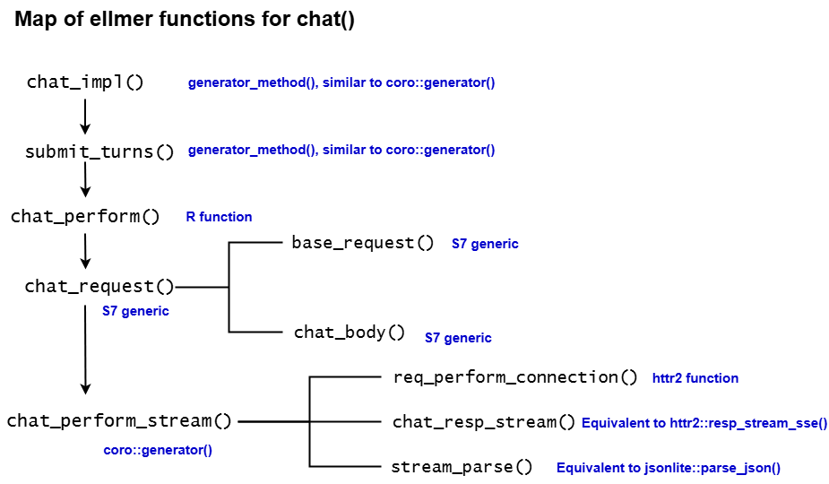

## Introduction

[ellmer](https://ellmer.tidyverse.org/){target="_blank"} is an R package designed to easily call LLM APIs from R. It supports a wide variety of model providers, including [Google Gemini/Vertex AI](https://ellmer.tidyverse.org/reference/chat_google_gemini.html){target="_blank"}, [Anthropic Claude](https://ellmer.tidyverse.org/reference/chat_anthropic.html){target="_blank"}, [OpenAI](https://ellmer.tidyverse.org/reference/chat_openai.html){target="_blank"}, and [Ollama](https://ellmer.tidyverse.org/reference/chat_ollama.html){target="_blank"}. Although there are resources on how to _use_ ellmer, as of this writing, there is no explanation on how ellmer _works_.

This blog series will dive deep into the [source code](https://github.com/tidyverse/ellmer/){target="_blank"} of ellmer, aiming to build an understanding of how ellmer interfaces with LLM APIs. We will use the Google Gemini API, which provides a generous free tier.

Note that the ellmer R package is currently at version `0.3.0`, indicating it is still in the early stages of development and subject to change.

```{r}
library(ellmer)

chat <- chat_google_gemini()
chat$chat("Who created the R programming language?")
```

Part 1 takes a deep dive into the `chat_google_gemini()` function, which results in a `Chat` object, and the `$chat()` method, which submits input to the chatbot, and returns the response as a string.

## Setup

Let's look at `chat_google_gemini()`, starting with its arguments:

```{r}
system_prompt = NULL
base_url = "https://generativelanguage.googleapis.com/v1beta/"
api_key = NULL
model = NULL
params = NULL
api_args = list()
api_headers = character()
echo = NULL
```

Arguments:

-   `system_prompt`: A system prompt to set the behavior of the assistant.

-   `base_url`: The base URL to the endpoint

-   `api_key`: Gemini API Key

-   `model`: LLM model (Defaults to `gemini-2.5-flash`)

-   `params` : Common model parameters, usually created by `params()`.

-   `api_args`: Named list of arbitrary extra arguments appended to the body of every chat API call. Combined with the body object generated by ellmer with `modifyList()`.

-   `api_headers`: Named character vector of arbitrary extra headers appended to every chat API call.

- `echo`: One of the following options:
  -   `none`: don't emit any output (default when running in a function).
  -   `output`: echo text and tool-calling output as it streams in (default when running at the console).
  -   `all`: echo all input and output.

## Util functions

The following functions create the `model`, `echo`, and `credentials` objects:

1. `set_default()`.
2.  `check_echo()`.
3.  `default_google_credentials()`.

### Choose Model

```{r}
model <- set_default(model, "gemini-2.5-flash")

# Definition of set_default()
set_default <- function(value, default, arg = caller_arg(value)) {
  if (is.null(value)) {
    if (!is_testing() || is_snapshot()) {
      cli::cli_inform("Using {.field {arg}} = {.val {default}}.")
    }
    default
  } else {
    value
  }
}
```

- If the `model` argument is `NULL`, it defaults to `gemini-2.5-flash`(the default as of this writing) and an informative message is displayed : Using model = "gemini-2.5-flash".
- If `model` value is provided, that value is used.

::: {.callout-note}
This function uses `rlang::caller_arg()` to capture the name of a function argument (in this case, `model`) as a string. `rlang::caller_arg()` is designed for better error reporting.
:::


### Configure Echo

```{r}
echo <- check_echo(echo)

# Definition of check_echo()
check_echo <- function(echo = NULL) {
  if (identical(echo, "text")) {
    lifecycle::deprecate_soft(
      when = "0.2.0",
      what = I('`echo = "text"`'),
      with = I('`echo = "output"`')
    )
    echo <- "output"
  }

  if (is.null(echo) || identical(echo, c("none", "output", "all"))) {
    option <- getOption("ellmer_echo")

    if (!is.null(option)) {
      option
    } else if (env_is_user_facing(parent.frame(2))) {
      "output"
    } else {
      "none"
    }
  } else if (isTRUE(echo)) {
    "output"
  } else if (isFALSE(echo)) {
    "none"
  } else {
    arg_match(echo, c("none", "output", "all"))
  }
}
```

- If `echo` is `NULL` and code is currently executing in a user-facing environment, `check_echo()` sets the `echo` object to `output`. 
- If the `echo` argument is set to `TRUE`, then the `echo` object is set to `output`.
- If the `echo` argument is set to `FALSE`, then the `echo` object is set to `none`.

::: {.callout-note}
`rlang::env_is_user_facing(parent.frame(2))` checks whether the code is currently executing in a user-facing environment.
:::


### Set Google Credentials

```{r}
credentials <- default_google_credentials(api_key, gemini = TRUE)
```

`default_google_credentials()` grabs the `api_key` from an .Renviron file. Then, it sets the `credentials` object to `function() {list("x-goog-api-key" = api_key)}`.


## ProviderGoogleGemini

```{r}
provider <- ProviderGoogleGemini(
  name = "Google/Gemini",
  base_url = base_url,
  model = model,
  params = params %||% params(),
  extra_args = api_args,
  api_key = api_key,
  credentials = credentials
)
```

`ProviderGoogleGemini` is an [S7 class](https://github.com/RConsortium/S7){target="_blank"} whose parent class is `Provider` and has the following properties:

From the `Provider` S7 class: 

- `name`: Name of the provider. 
- `model`: Name of the model. 
- `base_url`: The base URL for the API.
- `params`: A list of standard parameters created by `params()`. 
- `extra_args`: Arbitrary extra arguments to be included in the request body. 
- `extra_headers`: Arbitrary extra headers to be added to the request.

From the `ProviderGoogleGemini` S7 class: 

- `api_key`: API key for Google Gemini 
- `credentials`: `class_function | NULL`, meaning either a function class or `NULL`. 
- `model`: Name of model


## Chat R6 class

```{r}
Chat$new(provider = provider, system_prompt = system_prompt, echo = echo)
```

`Chat` is an [R6 class](https://r6.r-lib.org/articles/Introduction.html) initialized with private members:

```{r}
private$provider <- provider
private$echo <- echo
private$callback_on_tool_request <- CallbackManager$new(args = "request")
private$callback_on_tool_result <- CallbackManager$new(args = "result")
self$set_system_prompt(system_prompt)
```

Since tool-calling is not the focus of this blog post, we'll set the callback aside and focus on `provider`, `echo`, and `$set_system_prompt(system_prompt)`.

-   `provider` refers to the S7 class initialized earlier.
-   `echo` is assigned the value of `output`.
-   `$set_system_prompt()` removes any existing system prompt and adds a new system prompt (if `system_prompt` is not `NULL`).

## `$chat()` method

Once the Chat R6 class is initiated with `chat <- chat_google_gemini()`, we run the `$chat() method`, which accepts an user prompt. Inside `user_turn(...)`, the `user_prompt` is provided. In this blog post, the user prompt will be `"Who created the R programming language?"`.

::: {.callout-tip}
R was created by Ross Ihaka and Robert Gentleman at the University of Auckland in New Zealand.
::: 


```{r}
chat = function(..., echo = NULL) {
  turn <- user_turn(...)
  echo <- check_echo(echo %||% private$echo)
  
  # Returns a single turn (the final response from the assistant), even if
  # multiple rounds of back and forth happened.
  coro::collect(private$chat_impl(
    turn,
    stream = echo != "none",
    echo = echo
  ))
  
  text <- self$last_turn()@text
  if (echo == "none") text else invisible(text)
}
```


First, lets dig into the `user_turn()` function:

```{r}
# Definition of user_turn()
user_turn <- function(..., .call = caller_env()) {
  as_user_turn(list2(...), call = .call, arg = "...")
}

# Definition of as_user_turn()
as_user_turn <- function(contents, call = caller_env(), arg = "...") {
  if (length(contents) == 0) {
    cli::cli_abort("{.arg {arg}} must contain at least one input.", call = call)
  }
  if (is_named(contents)) {
    cli::cli_abort("{.arg {arg}} must be unnamed.", call = call)
  }
  if (S7_inherits(contents, Content)) {
    return(Turn("user", list(contents)))
  }
  
  contents <- lapply(contents, as_content, error_call = call, error_arg = arg)
  Turn("user", contents)
}
```

`as_user_turn()`:

1. Checks whether length of `contents` is 0. If so, signal an error. 
2. Checks whether `contents` is named (whether contents has a names attribute). If so, signal an error. 
3. Applies `as_content()` over `contents` (more on this below).
4. Creates a `Turn` S7 object from `contents`. A `Turn` object contains a list of `Content`s representing the individual messages (text, images, tools) within the turn.


`as_content()`:

```{r}
as_content <- function(x, error_call = caller_env(), error_arg = "...") {
  if (is.null(x)) {
    list()
  } else if (is_prompt(x)) {
    if (length(x) == 1) {
      ContentText(x[[1]])
    } else {
      cli::cli_abort(
        "{.arg {error_arg}} can only accept a single prompt.",
        call = error_call
      )
    }
  } else if (is.character(x)) {
    ContentText(paste0(x, collapse = "\n\n"))
  } else if (S7_inherits(x, Content)) {
    x
  } else {
    stop_input_type(
      x,
      what = "made up strings or <content> objects",
      arg = error_arg,
      error_call = error_call
    )
  }
}
```

-   If `x` is `NULL`, return an empty list.
-   If `x` inherits from the `ellmer_prompt` class, create a `ContentText` object.
-   If `x` is a character, create a `ContentText` object.
-   If `x` inherits from Content S7 class, return `x`

`as_content()` creates a new S7 `ContentText` object, with `text` as its only property.


We move on to the second line of the `$chat() method`:
```{r}
echo <- check_echo(echo %||% private$echo)
```

If `echo` is `NULL`, this line sets echo to `private$echo`, which is `output`.


::: {.callout-note}
`rlang::%||%` is the "null-default" operator. It returns the left-hand side if it’s not `NULL`, otherwise it returns the right-hand side.
:::


## Chat Implementation

The remainder of the blog post focuses on the functions that power the `$chat()` method. Since the functions can lead us down rabbit holes, I've organized the key ones into this diagram:



<br>

We first start with `chat_impl`, which is a `generator_method`, similar to a `coro::generator`. Generators create iterator functions, which are functions you can call to return a new value. You can learn more about generators in the [coro documentation](https://coro.r-lib.org/articles/generator.html#generators){target="_blank"}.

```{r}
chat_impl = generator_method(function(
      self,
      private,
      user_turn,
      stream,
      echo,
      yield_as_content = FALSE
    ) 
```

Inside `chat_impl`, the `$submit_turns()` method leads to `chat_perform()`:

```{r}
response <- chat_perform(
  provider = private$provider
  mode = if (stream) "stream" else "value",
  turns = c(private$.turns, list(user_turn)),
  tools = if (is.null(type)) private$tools,
  type = type 
)
```

`chat_perform()` leads to `chat_request()`, an S7 generic, and the method shown below is its implementation for the `ProviderGoogleGemini` class.

```{r}
method(chat_request, ProviderGoogleGemini) <- function(
  provider,
  stream = TRUE,
  turns = list(),
  tools = list(),
  type = NULL
) {
  req <- base_request(provider)

  # Can't use chat_path() because it varies based on stream
  req <- req_url_path_append(req, "models")
  if (stream) {
    # https://ai.google.dev/api/generate-content#method:-models.streamgeneratecontent
    req <- req_url_path_append(
      req,
      paste0(provider@model, ":", "streamGenerateContent")
    )
    req <- req_url_query(req, alt = "sse")
  } else {
    # https://ai.google.dev/api/generate-content#method:-models.generatecontent
    req <- req_url_path_append(
      req,
      paste0(provider@model, ":", "generateContent")
    )
  }

  body <- chat_body(
    provider = provider,
    stream = stream,
    turns = turns,
    tools = tools,
    type = type
  )
  body <- modify_list(body, provider@extra_args)

  req <- req_body_json(req, body)
  req <- req_headers(req, !!!provider@extra_headers)
  req
}
```

`base_request()` is an S7 generic, and the method shown below is its implementation for the `ProviderGoogleGemini` class.

```{r}
method(base_request, ProviderGoogleGemini) <- function(provider) {
  req <- request(provider@base_url) 
  req <- ellmer_req_credentials(req, provider@credentials) 
  req <- req_retry(req, max_tries = 2)
  req <- ellmer_req_timeout(req, stream) 
  req <- ellmer_req_user_agent(req) # 
  req <- req_error(req, body = function(resp) {
    json <- resp_body_json(resp, check_type = FALSE) 
    json$error$message
  }) 
  req
}
```

`base_request()`: 

1. Creates a new HTTP request with provider's base url. 
2. Adds headers with credentials (with `req_headers()`). 
3. Caps the maximum number of attempts (`max_tries`) to 2. 
4. Set curl option of HTTP timeout to 5 minutes. 
6. Set user-agent for request (`r-ellmer/0.3.0.900`).
7. Control handling of HTTP errors by returning a character vector of the error message.

After `base_request()` is run, the `req` object is as follows:

``` r
<httr2_request>
GET https://generativelanguage.googleapis.com/v1beta/
Headers:
* x-goog-api-key: <REDACTED>
Body: empty
Options:
* timeout_ms    : 3e+05
* connecttimeout: 0
* useragent     : "r-ellmer/0.3.0.9000"
Policies:
* retry_max_tries        : 3
* retry_on_failure       : TRUE
* retry_failure_threshold: Inf
* retry_failure_timeout  : 30
* retry_realm            : "generativelanguage.googleapis.com"
* error_body             : <function>
```

Note that this is a GET request, so the body is empty. The base URL is defined, and additional parameters will be appended to it.

```{r}
req <- req_url_path_append(req, "models")
```

Above line adds `/models` to the end of the path.

Since `stream` is `TRUE`, we have the following:

```{r}
req <- req_url_path_append(
  req,
  paste0(provider@model, ":", "generateContent")
)

req <- req_url_query(req, alt = "sse")
```

Above code appends `paste0(provider@model, ":", "generateContent")` and `?alt=sse` to the request path.

The `?alt=sse` query parameter specifies the response should be returned using [Server-Sent Events (SSE)](https://en.wikipedia.org/wiki/Server-sent_events){target="_blank"}, allowing data to be streamed incrementally as it is generated, rather than waiting for the full response.

Together, these functions reconstruct the URL found in the Example Request from the [Google AI Documentation](https://ai.google.dev/api/generate-content?authuser=1#example-request_1){target="_blank"}.

With the request URL completely constructed, we move on to constructing the body of the request with `chat_body()`, another S7 generic. The method shown below is its implementation for the `ProviderGoogleGemini` class.

```{r}
method(chat_body, ProviderGoogleGemini) <- function(
    provider,
    stream = TRUE,
    turns = list(),
    tools = list(),
    type = NULL
) {
  if (length(turns) >= 1 && is_system_prompt(turns[[1]])) { 
    system <- list(parts = list(text = turns[[1]]@text))  
  } else {
    system <- list(parts = list(text = ""))
  }
  
  generation_config <- chat_params(provider, provider@params)
  if (!is.null(type)) {
    generation_config$response_mime_type <- "application/json"
    generation_config$response_schema <- as_json(provider, type)
  }
  
  contents <- as_json(provider, turns)
  
  # https://ai.google.dev/api/caching#Tool
  if (length(tools) > 0) {
    funs <- as_json(provider, unname(tools))
    tools <- list(functionDeclarations = funs)
  } else {
    tools <- NULL
  }
  
  compact(list(
    contents = contents,
    tools = tools,
    systemInstruction = system,
    generationConfig = generation_config
  ))
}

```

This converts R objects into the JSON format expected by Google’s Gemini API for chat conversations, as described in the [Google AI documentation](https://ai.google.dev/api/generate-content?authuser=1#request-body_1){target="_blank"} under "Request body."

1.  If a system prompt is provided, assign its text to the `system` object; otherwise, assign an empty string.
2.  Define configuration options for model generation and outputs.
3.  Format `contents` as JSON.
4.  Since tool-calling is not being used, set `tools` to `NULL`.

```{r}
body <- modify_list(body, provider@extra_args)

req <- req_body_json(req, body)
req <- req_headers(req, !!!provider@extra_headers)
```

1.  `modify_list()` modifies `body`, a list, by updating it with values from `provider@extra_args`.
2.  Sends the `body` object in JSON encoded data.
3.  Sets value of any headers.

After `chat_request()` is run and `req` is completely constructed, we end up with the request below:

```r
<httr2_request>
POST https://generativelanguage.googleapis.com/v1beta/models/gemini-2.5-flash:streamGenerateContent?alt=sse
Headers:
* x-goog-api-key: <REDACTED>
Body: JSON data
Options:
* timeout_ms    : 3e+05
* connecttimeout: 0
* useragent     : "r-ellmer/0.3.0.9000"
Policies:
* retry_max_tries        : 3
* retry_on_failure       : TRUE
* retry_failure_threshold: Inf
* retry_failure_timeout  : 30
* retry_realm            : "generativelanguage.googleapis.com"
* error_body             : <function>
```


Then, we run `chat_perform_stream(provider, req)` since `mode` is set to `stream`. Note that `chat_perform_stream()` is a [coro::generator](https://coro.r-lib.org/articles/generator.html#generators){target="_blank"}.

```{r}
on_load(
  chat_perform_stream <- coro::generator(function(provider, req) {
    resp <- req_perform_connection(req)
    on.exit(close(resp))

    repeat {
      event <- chat_resp_stream(provider, resp)
      data <- stream_parse(provider, event)
      if (is.null(data)) {
        break
      } else {
        yield(data)
      }
    }
  })
)
```

`on_load()` is an [rlang function](https://rlang.r-lib.org/reference/on_load.html){target="_blank"} that registers expressions to be run on the user's machine each time the package is loaded in memory.

1.  `req_perform_connection(req)` performs a request and returns a streaming connection to the Google Gemini API. A streaming connection lets you retrieve data a chunk at a time. Also, it provides real-time delivery, allowing for a seamless experience of talking to a chatbot.
2.  `on.exit(close(resp))` sets up code that runs when the function exits. Specifically, it will run `close(resp)`, which closes the connection and prevents resource leaks.
3. `repeat{}` creates an infinite loop with  until it encounters a `break`.
4.  `chat_resp_stream()` reads a single [server-sent event](https://developer.mozilla.org/en-US/docs/Web/API/Server-sent_events/Using_server-sent_events){target="_blank"}.
5.  `stream_parse()` parses a JSON string and converts it into R objects.

If `data` is `NULL`, then exit the loop with a `break` statement. If `data`is non-`NULL`, then it sends data back to caller.

Response (`resp`):
``` r
<httr2_response>
POST https://generativelanguage.googleapis.com/v1beta/models/gemini-2.5-flash:streamGenerateContent?alt=sse
Status: 200 OK
Content-Type: text/event-stream
Body: Streaming connection
```

First iteration of the `repeat` loop:

> The R programming language was created by **Ross Ihaka** and **Robert Gentleman**.\n\nThey started the project in **1992** at the


Second iteration of the `repeat` loop:

> University of Auckland, New Zealand. R was designed as an open-source implementation of the S programming language, with a focus on statistical computing and graphics.\n\n While they were the original creators, its development is now sustained by the **R**


Third iteration of the `repeat` loop:

> **Core Team**, an international group of volunteer developers.


Full text of response:

> The R programming language was created by **Ross Ihaka** and **Robert Gentleman**.\n\n They started the project in **1992** at the University of Auckland, New Zealand. R was designed as an open-source implementation of the S programming language, with a focus on statistical computing and graphics.\n\n While they were the original creators, its development is now sustained by the **R Core Team**, an international group of volunteer developers.


## Conclusion

In this blog post, we took a closer look at how the `Chat` object and its `$chat()` method work under the hood. The ellmer package's core functionality involves sending a structured API request and establishing a streaming connection to the API using the httr2 package. The package also supports other features like tool-calling and accepts various forms of user input, such as images and videos. More on these in the upcoming posts as part of this blog series on ellmer.

Thanks for reading.