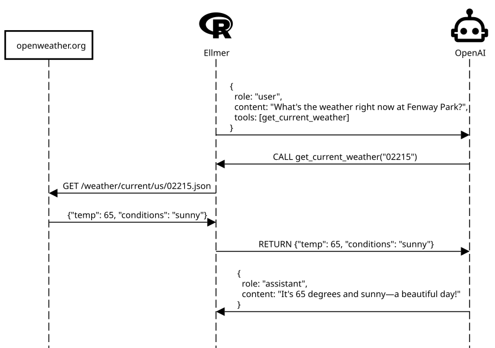

## Introduction

[ellmer](https://ellmer.tidyverse.org/){target="_blank"} is an R package designed to easily call LLM APIs from R. It supports a wide variety of model providers, including [Google Gemini/Vertex AI](https://ellmer.tidyverse.org/reference/chat_google_gemini.html){target="_blank"}, [Anthropic Claude](https://ellmer.tidyverse.org/reference/chat_anthropic.html){target="_blank"}, [OpenAI](https://ellmer.tidyverse.org/reference/chat_openai.html){target="_blank"}, and [Ollama](https://ellmer.tidyverse.org/reference/chat_ollama.html){target="_blank"}. Although there are resources on how to *use* ellmer, as of this writing, there is no explanation on how ellmer *works*.

This blog series will dive deep into the [source code](https://github.com/tidyverse/ellmer/){target="_blank"} of ellmer, aiming to build an understanding of how ellmer interfaces with LLM APIs. We will use the Google Gemini API, which provides a generous free tier.

Note that the ellmer R package is currently at version `0.3.0`, indicating it is still in the early stages of development and subject to change.

```{r}
library(ellmer)
```

Part 2 takes a deep dive into tool calling. Tool calling: Provide LLM with tools it can call (tool is synonymous with function). Joe Cheng's example: think of a brain in a jar. It does not have any ability other than the questions you ask it. 

How tool calling works:



### Notes from "Demystifying LLMs with Ellmer" (Joe Cheng)

Ellmer asks OpenAI a question, "What is the weather in Seattle?". Attached a tool. A tool is a name of a function, a description of what it does, a list of arguments, and the argument types. The OpenAI model responds with "call `get_current_weather()` to the client, ellmer". And Ellmer is responsible for calling `get_current_weather()`.

What is the benefit the OpenAI model providing if we are the ones doing the work at the end of the day?
OpenAI is deciding 
- when it is appropriate to call the tool
- what arguments to pass to the tool
- how to interpret the results. 


```r
I'll help you get the weather information for Seattle. To use the weather function, I need the latitude and longitude coordinates 
for Seattle.

Seattle's coordinates are approximately:
- Latitude: 47.6062
- Longitude: -122.3321

Let me fetch the current weather information for you.
◯ [tool call] get_weather(latitude = 47.6062, longitude = -122.3321)
● #> {"latitude":47.595562,"longitude":-122.32443,"generationtime_ms":0.048995018005371094,"utc_offset_seconds":0,"timezone":"G…
Based on the weather data for Seattle, here's the current weather information in imperial units:

**Current Weather in Seattle:**
- **Temperature:** 70.3°F (21.3°C)
- **Wind Speed:** 1.6 mph (2.5 km/h)
- **Humidity:** 52%
- **Time:** 1:45 AM GMT

The weather in Seattle is quite pleasant with mild temperatures and light winds. The humidity is at a comfortable level of 52%.
```


Output of `client`:
```r
<Chat Anthropic/claude-sonnet-4-20250514 turns=5 tokens=1237/257 $0.01>
── system [0] ------------------------------ 
You are a helpful assistant that can check the weather. Report results in imperial units.
── user [466] ------------------------------ 
What is the weather in Seattle?
── assistant [143] ------------------------------
I'll help you get the weather information for Seattle. To use the weather function, I need the latitude and longitude coordinates for Seattle.

Seattle's coordinates are approximately:
- Latitude: 47.6062
- Longitude: -122.3321

Let me fetch the current weather information for you.
[tool request (toolu_01AhcDmFFHkTvpCzDw7JLZXX)]: get_weather(latitude = 47.6062, longitude = -122.3321)
── user [162] ------------------------------
[tool result  (toolu_01AhcDmFFHkTvpCzDw7JLZXX)]: {"latitude":47.595562,"longitude":-122.32443,"generationtime_ms":0.048995018005371094,"utc_offset_seconds":0,"timezone":"GMT","timezone_abbreviation":"GMT","elevation":59.0,"current_units":{"time":"iso8601","interval":"seconds","temperature_2m":"°C","wind_speed_10m":"km/h","relative_humidity_2m":"%"},"current":{"time":"2025-08-19T01:45","interval":900,"temperature_2m":21.3,"wind_speed_10m":2.5,"relative_humidity_2m":52}}
── assistant [114] ------------------------------
Based on the weather data for Seattle, here's the current weather information in imperial units:

**Current Weather in Seattle:**
- **Temperature:** 70.3°F (21.3°C)
- **Wind Speed:** 1.6 mph (2.5 km/h)
- **Humidity:** 52%
- **Time:** 1:45 AM GMT

The weather in Seattle is quite pleasant with mild temperatures and light winds. The humidity is at a comfortable level of 52%.
```

User asks assistant a question with metadata for available tools -> Assistant asks user to invoke a tool, passing the desired arguments -> User invokes tool, returns output to the assistant -> Assistant incorporates tool's output as additional context for formulating a response. 


## Helper function for `tool()`

`create_tool_def()` is a helper function for crafting the right call to `tool()`. It extracts the function documentation and uses an LLM to generate the right `tool()` call. Let's dive into the source code.

```{r}
topic = rnorm
chat = NULL
model = deprecated()
echo = interactive()
verbose = FALSE
```

Setup arguments. We want to generate the `tool()` call for the `rnorm()` function, for generating random numbers according to the normal distribution. This is our `topic`. Then, we 


```{r}
expr <- enexpr(topic)
```

makes the `topic` argument an expression, which in R is an "object t captures the structure of the code without evaluating it (i.e. running it). " (https://adv-r.hadley.nz/expressions.html#introduction-17). 

The following function checks that the only one of the arguments `model` and `chat` is supplied. 

```{r}
check_exclusive(model, chat, .require = FALSE)
```

The reason is that `model` argument has been deprecated, instead user needs to use the `chat` argument instead. 

```{r}
if (is.null(chat)) {
  chat <- chat_openai()
} else if (is_chat(chat)) {
  chat <- chat$clone()
} else {
  stop_input_type(chat, "a <Chat> object", allow_null = TRUE)
}
```

If `chat` is `NULL`, we assign `chat`to `chat_openai()`. If  `chat` is a `Chat` object, then we clone it (create a copy of the object that behaves identically) and assign the clone to `chat`. 


```{r}
tool_prompt <- read_file(system.file("tool_prompt.md", package = "ellmer"))
chat$set_system_prompt(tool_prompt)
```

Read in the tool prompt, in markdown, and set as a system prompt (used to provide additional instructions to the LLM and shape its responses to your needs) Source: https://ellmer.tidyverse.org/articles/ellmer.html#what-is-a-prompt

All in all, `create_tool_def()` provides a system prompt instructing the LLM to take a function documentation and turn it into a `tool()` call definition. 


## Define a tool function

Here is an example of OpenAI's GPT-4 generating a tool call definition for `rnorm()`:

```{r}
tool(
  stats::rnorm,
  name = "rnorm",
  description = "Generate random deviates from the normal distribution with specified mean and standard 
deviation.",
  arguments = list(
    n = type_integer(
      "Number of random observations to generate. If 'length(n) > 1', the length is taken to be the
number required."
    ),
    mean = type_number(
      "Mean of the normal distribution. Defaults to 0.",
      required = FALSE
    ),
    sd = type_number(
      "Standard deviation of the normal distribution. Defaults to 1.",
      required = FALSE
    )
  )
)
```

`tool()` is a function that defines a tool and returns an S7 `ToolDef` object.

```{r}
ToolDef(
  fun,
  name = name,
  description = description,
  arguments = TypeObject(properties = arguments),
  convert = convert,
  annotations = annotations
)
```


`$register_tool()` gives our chat object access to the tool.

```{r}
register_tool = function(tool) {
  check_tool(tool)
  if (has_name(private$tools, tool@name)) {
    cli::cli_inform("Replacing existing {tool@name} tool.")
  }

  private$tools[[tool@name]] <- tool
  invisible(self)
}
```

Adds above `TurnDef` S7 object to `private$tools`, a list.


## Walkthrough of Tool-Calling

From Tool-Calling Vignette: https://ellmer.tidyverse.org/articles/tool-calling.html

Initialize `chat` object: `chat <- chat_openai()`
```{r}
# Arguments to chat_openai()
system_prompt = NULL
base_url = Sys.getenv("OPENAI_BASE_URL", "https://api.openai.com/v1")
api_key = openai_key()
model = NULL
params = NULL
api_args = list()
api_headers = character()
echo = "output"

# Code inside chat_openai()
model <- set_default(model, "gpt-4.1")
echo <- check_echo(echo)
params <- params %||% params()

provider <- ProviderOpenAI(
  name = "OpenAI",
  base_url = base_url,
  model = model,
  params = params,
  extra_args = api_args,
  extra_headers = api_headers,
  api_key = api_key
)

chat <- Chat$new(provider = provider, system_prompt = system_prompt, echo = echo)

# Needed for later calls
private <- list()
private$provider <- provider
```

Function to get current time
```{r}
#' Gets the current time in the given time zone.
#'
#' @param tz The time zone to get the current time in.
#' @return The current time in the given time zone.
get_current_time <- function(tz = "UTC") {
  format(Sys.time(), tz = tz, usetz = TRUE)
}
```

Turn the above function into a tool 
```{r}
get_current_time <- tool(
  get_current_time,
  name = "get_current_time",
  description = "Returns the current time.",
  arguments = list(
    tz = type_string(
      "Time zone to display the current time in. Defaults to `\"UTC\"`.",
      required = FALSE
    )
  )
)
```


Give our `chat` object access to our tool
```{r}
# chat$register_tool(get_current_time)
private$tools[[get_current_time@name]] <- get_current_time
```

Run a query with the `$chat()` method and our user prompt `"How long ago did Neil Armstrong touch down on the moon?"`
```{r}
user_prompt <- "How long ago did Neil Armstrong touch down on the moon?"

turn <- user_turn(user_prompt)
echo <- check_echo(echo %||% private$echo)
```

Chat implementation method `$chat_impl()` leads to `$submit_turns()`, which then leads to `chat_perform()`.

`chat_perform()` results in a generator instance called `response` (created by calling a generator function):
```{r}
> response
<generator/instance>
function(provider, req) {
    resp <- req_perform_connection(req)
    on.exit(close(resp))

    repeat {
      event <- chat_resp_stream(provider, resp)
      data <- stream_parse(provider, event)
      if (is.null(data)) {
        break
      } else {
        yield(data)
      }
    }
  }
<environment: namespace:ellmer>
```

The generator is designed for streaming responses, so manually calling it until exhausted makes the most sense for your streaming use case.

Use `coro::collect()` to get all values:
```{r}
all_chunks <- coro::collect(response)
```


```{r}
> all_chunks
[[1]]
[[1]]$id
[1] "chatcmpl-CB4n3VbyZbyrupX1yU2jM3UQmWdPq"

[[1]]$object
[1] "chat.completion.chunk"

[[1]]$created
[1] 1756756057

[[1]]$model
[1] "gpt-4.1-2025-04-14"

[[1]]$service_tier
[1] "default"

[[1]]$system_fingerprint
[1] "fp_daf5fcc80a"

[[1]]$choices
[[1]]$choices[[1]]
[[1]]$choices[[1]]$index
[1] 0

[[1]]$choices[[1]]$delta
[[1]]$choices[[1]]$delta$role
[1] "assistant"

[[1]]$choices[[1]]$delta$content
NULL

[[1]]$choices[[1]]$delta$tool_calls
[[1]]$choices[[1]]$delta$tool_calls[[1]]
[[1]]$choices[[1]]$delta$tool_calls[[1]]$index
[1] 0

[[1]]$choices[[1]]$delta$tool_calls[[1]]$id
[1] "call_Ey42w3gZblkSeZtlGFxRPjhl"

[[1]]$choices[[1]]$delta$tool_calls[[1]]$type
[1] "function"

[[1]]$choices[[1]]$delta$tool_calls[[1]]$`function`
[[1]]$choices[[1]]$delta$tool_calls[[1]]$`function`$name
[1] "get_current_time"

[[1]]$choices[[1]]$delta$tool_calls[[1]]$`function`$arguments
[1] ""


[[1]]$choices[[1]]$delta$refusal
NULL


[[1]]$choices[[1]]$logprobs
NULL

[[1]]$choices[[1]]$finish_reason
NULL


[[1]]$usage
NULL

[[1]]$obfuscation
[1] "oxf"


[[2]]
[[2]]$id
[1] "chatcmpl-CB4n3VbyZbyrupX1yU2jM3UQmWdPq"

[[2]]$object
[1] "chat.completion.chunk"

[[2]]$created
[1] 1756756057

[[2]]$model
[1] "gpt-4.1-2025-04-14"

[[2]]$service_tier
[1] "default"

[[2]]$system_fingerprint
[1] "fp_daf5fcc80a"

[[2]]$choices
[[2]]$choices[[1]]
[[2]]$choices[[1]]$index
[1] 0

[[2]]$choices[[1]]$delta
[[2]]$choices[[1]]$delta$tool_calls
[[2]]$choices[[1]]$delta$tool_calls[[1]]
[[2]]$choices[[1]]$delta$tool_calls[[1]]$index
[1] 0

[[2]]$choices[[1]]$delta$tool_calls[[1]]$`function`
[[2]]$choices[[1]]$delta$tool_calls[[1]]$`function`$arguments
[1] "{\""


[[2]]$choices[[1]]$logprobs
NULL

[[2]]$choices[[1]]$finish_reason
NULL


[[2]]$usage
NULL

[[2]]$obfuscation
[1] "oY"


[[3]]
[[3]]$id
[1] "chatcmpl-CB4n3VbyZbyrupX1yU2jM3UQmWdPq"

[[3]]$object
[1] "chat.completion.chunk"

[[3]]$created
[1] 1756756057

[[3]]$model
[1] "gpt-4.1-2025-04-14"

[[3]]$service_tier
[1] "default"

[[3]]$system_fingerprint
[1] "fp_daf5fcc80a"

[[3]]$choices
[[3]]$choices[[1]]
[[3]]$choices[[1]]$index
[1] 0

[[3]]$choices[[1]]$delta
[[3]]$choices[[1]]$delta$tool_calls
[[3]]$choices[[1]]$delta$tool_calls[[1]]
[[3]]$choices[[1]]$delta$tool_calls[[1]]$index
[1] 0

[[3]]$choices[[1]]$delta$tool_calls[[1]]$`function`
[[3]]$choices[[1]]$delta$tool_calls[[1]]$`function`$arguments
[1] "tz"


[[3]]$choices[[1]]$logprobs
NULL

[[3]]$choices[[1]]$finish_reason
NULL


[[3]]$usage
NULL

[[3]]$obfuscation
[1] "mtZ"


[[4]]
[[4]]$id
[1] "chatcmpl-CB4n3VbyZbyrupX1yU2jM3UQmWdPq"

[[4]]$object
[1] "chat.completion.chunk"

[[4]]$created
[1] 1756756057

[[4]]$model
[1] "gpt-4.1-2025-04-14"

[[4]]$service_tier
[1] "default"

[[4]]$system_fingerprint
[1] "fp_daf5fcc80a"

[[4]]$choices
[[4]]$choices[[1]]
[[4]]$choices[[1]]$index
[1] 0

[[4]]$choices[[1]]$delta
[[4]]$choices[[1]]$delta$tool_calls
[[4]]$choices[[1]]$delta$tool_calls[[1]]
[[4]]$choices[[1]]$delta$tool_calls[[1]]$index
[1] 0

[[4]]$choices[[1]]$delta$tool_calls[[1]]$`function`
[[4]]$choices[[1]]$delta$tool_calls[[1]]$`function`$arguments
[1] "\":\""


[[4]]$choices[[1]]$logprobs
NULL

[[4]]$choices[[1]]$finish_reason
NULL


[[4]]$usage
NULL

[[4]]$obfuscation
[1] ""


[[5]]
[[5]]$id
[1] "chatcmpl-CB4n3VbyZbyrupX1yU2jM3UQmWdPq"

[[5]]$object
[1] "chat.completion.chunk"

[[5]]$created
[1] 1756756057

[[5]]$model
[1] "gpt-4.1-2025-04-14"

[[5]]$service_tier
[1] "default"

[[5]]$system_fingerprint
[1] "fp_daf5fcc80a"

[[5]]$choices
[[5]]$choices[[1]]
[[5]]$choices[[1]]$index
[1] 0

[[5]]$choices[[1]]$delta
[[5]]$choices[[1]]$delta$tool_calls
[[5]]$choices[[1]]$delta$tool_calls[[1]]
[[5]]$choices[[1]]$delta$tool_calls[[1]]$index
[1] 0

[[5]]$choices[[1]]$delta$tool_calls[[1]]$`function`
[[5]]$choices[[1]]$delta$tool_calls[[1]]$`function`$arguments
[1] "UTC"


[[5]]$choices[[1]]$logprobs
NULL

[[5]]$choices[[1]]$finish_reason
NULL


[[5]]$usage
NULL

[[5]]$obfuscation
[1] "tN"


[[6]]
[[6]]$id
[1] "chatcmpl-CB4n3VbyZbyrupX1yU2jM3UQmWdPq"

[[6]]$object
[1] "chat.completion.chunk"

[[6]]$created
[1] 1756756057

[[6]]$model
[1] "gpt-4.1-2025-04-14"

[[6]]$service_tier
[1] "default"

[[6]]$system_fingerprint
[1] "fp_daf5fcc80a"

[[6]]$choices
[[6]]$choices[[1]]
[[6]]$choices[[1]]$index
[1] 0

[[6]]$choices[[1]]$delta
[[6]]$choices[[1]]$delta$tool_calls
[[6]]$choices[[1]]$delta$tool_calls[[1]]
[[6]]$choices[[1]]$delta$tool_calls[[1]]$index
[1] 0

[[6]]$choices[[1]]$delta$tool_calls[[1]]$`function`
[[6]]$choices[[1]]$delta$tool_calls[[1]]$`function`$arguments
[1] "\"}"


[[6]]$choices[[1]]$logprobs
NULL

[[6]]$choices[[1]]$finish_reason
NULL


[[6]]$usage
NULL

[[6]]$obfuscation
[1] "hd"


[[7]]
[[7]]$id
[1] "chatcmpl-CB4n3VbyZbyrupX1yU2jM3UQmWdPq"

[[7]]$object
[1] "chat.completion.chunk"

[[7]]$created
[1] 1756756057

[[7]]$model
[1] "gpt-4.1-2025-04-14"

[[7]]$service_tier
[1] "default"

[[7]]$system_fingerprint
[1] "fp_daf5fcc80a"

[[7]]$choices
[[7]]$choices[[1]]
[[7]]$choices[[1]]$index
[1] 0

[[7]]$choices[[1]]$delta
named list()

[[7]]$choices[[1]]$logprobs
NULL

[[7]]$choices[[1]]$finish_reason
[1] "tool_calls"


[[7]]$usage
NULL

[[7]]$obfuscation
[1] "f60"


[[8]]
[[8]]$id
[1] "chatcmpl-CB4n3VbyZbyrupX1yU2jM3UQmWdPq"

[[8]]$object
[1] "chat.completion.chunk"

[[8]]$created
[1] 1756756057

[[8]]$model
[1] "gpt-4.1-2025-04-14"

[[8]]$service_tier
[1] "default"

[[8]]$system_fingerprint
[1] "fp_daf5fcc80a"

[[8]]$choices
list()

[[8]]$usage
[[8]]$usage$prompt_tokens
[1] 107

[[8]]$usage$completion_tokens
[1] 15

[[8]]$usage$total_tokens
[1] 122

[[8]]$usage$prompt_tokens_details
[[8]]$usage$prompt_tokens_details$cached_tokens
[1] 0

[[8]]$usage$prompt_tokens_details$audio_tokens
[1] 0


[[8]]$usage$completion_tokens_details
[[8]]$usage$completion_tokens_details$reasoning_tokens
[1] 0

[[8]]$usage$completion_tokens_details$audio_tokens
[1] 0

[[8]]$usage$completion_tokens_details$accepted_prediction_tokens
[1] 0

[[8]]$usage$completion_tokens_details$rejected_prediction_tokens
[1] 0


[[8]]$obfuscation
[1] "iewwlXD41yGE"
```

The OpenAI model responded with streaming response data. This represents a streaming function call to:

- Function: get_current_time
- Arguments: {"tz":"UTC"}


```{r}
result <- NULL
for (chunk in all_chunks) {
  result <- stream_merge_chunks(private$provider, result, chunk)
}
```

Output:

```r
[[1]]$delta$tool_calls[[1]]$`function`
[[1]]$delta$tool_calls[[1]]$`function`$name
[1] "get_current_time"

[[1]]$delta$tool_calls[[1]]$`function`$arguments
[1] "{\"tz\":\"UTC\"}"
```


```{r}
turn <- value_turn(private$provider, result, has_type = !is.null(type))
```

`value_turn()` is an S7 generic, and the method shown below is its implementation for the `ProviderOpenAI` class

```{r}
method(value_turn, ProviderOpenAI) <- function(
  provider,
  result,
  has_type = FALSE
) {
  if (has_name(result$choices[[1]], "delta")) {
    # streaming
    message <- result$choices[[1]]$delta
  } else {
    message <- result$choices[[1]]$message
  }

  if (has_type) {
    if (is_string(message$content)) {
      json <- jsonlite::parse_json(message$content[[1]])
    } else {
      json <- message$content
    }
    content <- list(ContentJson(json))
  } else {
    content <- lapply(message$content, as_content)
  }
  if (has_name(message, "tool_calls")) {
    calls <- lapply(message$tool_calls, function(call) {
      name <- call$`function`$name
      # TODO: record parsing error
      args <- tryCatch(
        jsonlite::parse_json(call$`function`$arguments),
        error = function(cnd) list()
      )
      ContentToolRequest(name = name, arguments = args, id = call$id)
    })
    content <- c(content, calls)
  }

  # > content
  # [[1]]
  # <ellmer::ContentToolRequest>
  #  @ id       : chr "call_Ey42w3gZblkSeZtlGFxRPjhl"
  #  @ name     : chr "get_current_time"
  #  @ arguments:List of 1
  #  .. $ tz: chr "UTC"
  #  @ tool     : NULL

  if (is.null(result$usage)) {
    tokens <- tokens_log(provider)
  } else {
    cached_tokens <- result$usage$prompt_tokens_details$cached_tokens %||% 0
    tokens <- tokens_log(
      provider,
      input = result$usage$prompt_tokens - cached_tokens,
      output = result$usage$completion_tokens,
      cached_input = cached_tokens
    )
    # input, output, and cached input tokens
    # 107,   15,         0
  }
  assistant_turn(
    content,
    json = result,
    tokens = tokens
  )
  # Turn object for assistant turn
}
```