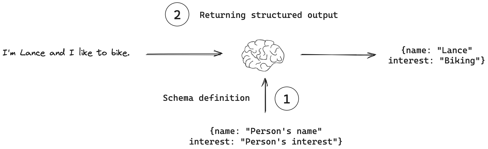
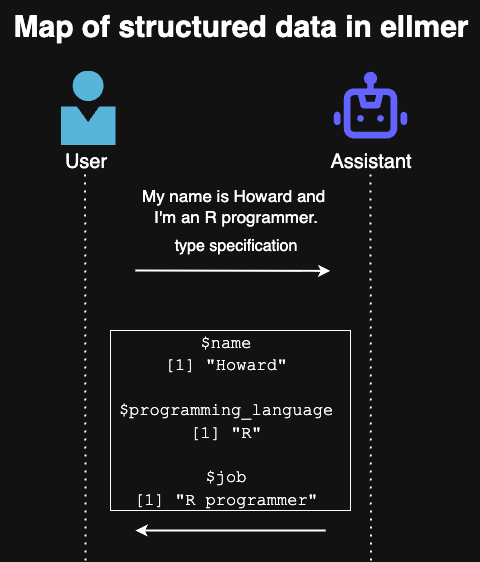

## Introduction

[ellmer](https://ellmer.tidyverse.org/){target="_blank"} is an R package designed to easily call LLM APIs from R. It supports a wide variety of model providers, including [Google Gemini/Vertex AI](https://ellmer.tidyverse.org/reference/chat_google_gemini.html){target="_blank"}, [Anthropic Claude](https://ellmer.tidyverse.org/reference/chat_anthropic.html){target="_blank"}, [OpenAI](https://ellmer.tidyverse.org/reference/chat_openai.html){target="_blank"}, and [Ollama](https://ellmer.tidyverse.org/reference/chat_ollama.html){target="_blank"}. Although there are resources on how to *use* ellmer, as of this writing, there is no explanation on how ellmer *works*.

This blog series will dive deep into the [source code](https://github.com/tidyverse/ellmer/){target="_blank"} of ellmer, aiming to build an understanding of how ellmer interfaces with LLM APIs. We will use the Google Gemini API, which provides a generous free tier.

Note that the ellmer R package is currently at version `0.3.0`, indicating it is still in the early stages of development and subject to change.

```{r}
library(ellmer)
# > packageVersion("ellmer")
# [1] ‘0.3.0’
```

Part 3 takes a deep dive into structured data (aka structured output). According to [LangChain](https://python.langchain.com/docs/concepts/structured_outputs/), structured outputs refer to the ability to direct language models to generate responses that conform to a specific predefined format or schema.



You supply the type specification that defines the object structure you want and the LLM ensures that’s what you’ll get back. We supply the type specification with the following functions in R:

-  `type_boolean()` for logicals
-  `type_integer()` for integers 
- `type_number()` for doubles
- `type_string()` for characters
- `type_enum()` for factors
- `type_array()` for vectors
-  `type_object()` for named lists. 
- There is no specific type for dates, but you can use `type_string()` and specify the date format you want: `type_string("The creation date, in YYYY-MM-DD format.")`. 

All these functions take the `description` parameter, which describes the purpose of the type specification. This is used by the LLM to determine what values to extract in the structured data. 


## Walkthrough of Structured Data

In the rest of this blog post, we will extract structured data using the `$chat_structured()` method of the `Chat` object in ellmer.



### Setup

First, we initialize the `chat` object: `chat <- chat_openai()`. We will use OpenAI's GPT 4.1 model. I will skip the details, as they were covered with great detail in [Deep Dive into ellmer: Part 1](https://www.howardbaik.com/posts/deep-dive-into-ellmer-part1/#setup){target="_blank"}.

### `$chat_structured()` method

In this section, we walk through the source code that powers the `$chat_structured()` method with the user prompt `"My name is Howard and I'm an R programmer"`. As mentioned above, we will also need to provide type specifications. From this user prompt, we would want to extract out the name (`type_string()`), the programming language (`type_string()`), and the job (`type_string()`) in a named list (`type_object()`).

```{r}
# Arguments to $chat_structured()
user_prompt <- "My name is Howard and I'm an R programmer"

# Type specification
type <- type_object(
  name = type_string(),
  programming_language = type_string(),
  job = type_string()
)

echo = "none"
convert = TRUE
```

`type_needs_wrapper()` checks if we're using an OpenAI provider and if `type` is something other than `TypeObject` or `TypeJsonSchema`. In our case, `needs_wrapper = FALSE` since `type` is a `TypeObject`. 

```{r}
turn <- user_turn(user_prompt, .check_empty = FALSE)
echo <- check_echo(echo %||% private$echo)
check_bool(convert)

needs_wrapper <- type_needs_wrapper(type, private$provider)
type <- wrap_type_if_needed(type, needs_wrapper)
```


### `$submit_turns()` method

Then, we run the `chat_perform()` function to perform a POST API request, which includes the type specification in the body, and get a response.

```{r}
# Setup for `chat_perform()`
stream <- echo != "none"
user_turn <- turn

# chat_perform()
response <- chat_perform(
  provider = private$provider,
  mode = if (stream) "stream" else "value",
  turns = c(private$.turns, list(user_turn)),
  tools = if (is.null(type)) private$tools,
  type = type
)
```

The `response` is as following:
```r
$choices[[1]]$message
$choices[[1]]$message$role
[1] "assistant"

$choices[[1]]$message$content
[1] "{\"name\":\"Howard\",\"programming_language\":\"R\",\"job\":\"R programmer\"}"
```

Given this `response`, we run

```{r}
has_type = TRUE

turn <- value_turn(
  private$provider,
  response,
  has_type = !is.null(type)
)
```

which creates a list of `ContentJson` ellmer object(s):

```r
> content
[[1]]
<ellmer::ContentJson>
 @ value:List of 3
 .. $ name                : chr "Howard"
 .. $ programming_language: chr "R"
 .. $ job                 : chr "R programmer"
```
and puts this `content`, `result`, and `tokens` in an assistant turn:

```r
<Turn: assistant>
[data] {
  "name": "Howard",
  "programming_language": "R",
  "job": "R programmer"
}
```

Finally, `self$add_turn(user_turn, turn)` adds the user turn (`user_turn`) and assistant turn (`turn`):

```{r}
private$.turns[[length(private$.turns) + 1]] <- user
private$.turns[[length(private$.turns) + 1]] <- system
```


### `extract_data()`

Finally, now that we have the response for structured data, we extract out the data:

```{r}
extract_data(turn, type, convert = convert, needs_wrapper = needs_wrapper)
```


Final output:
```r
$name
[1] "Howard"

$programming_language
[1] "R"

$job
[1] "R programmer"
```

We correctly get the name, the programming language, and the job from the user prompt. 


## Conclusion

In this blog post, we took a closer look at structured data in ellmer. We traced through the source code of the `$chat_structured()` method to understand the mechanics of extracting structured output from user input. 

This concludes the Deep Dive into ellmer blog series. 

Thanks for reading.