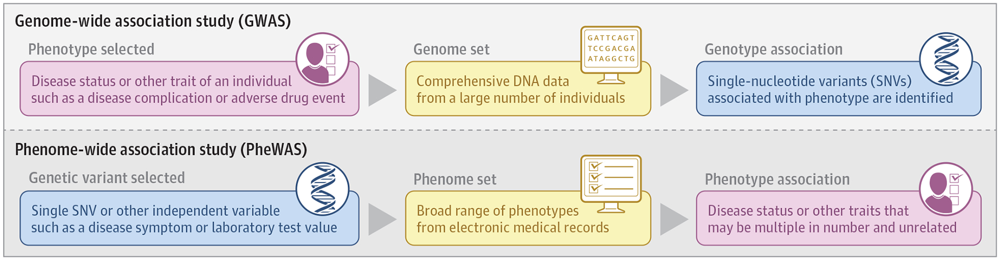
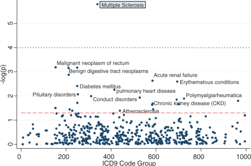
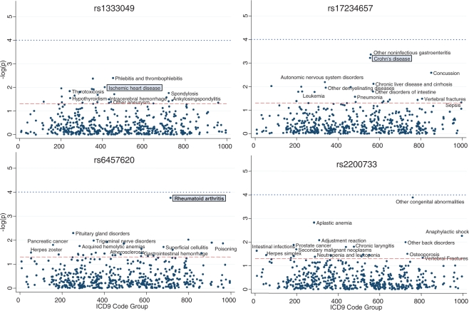

# Paper: "Phenome-Wide Association Studies" 

Bastarache L, Denny JC, Roden DM. Phenome-Wide Association Studies. JAMA. 2022 Jan 4;327(1):75-76. doi: 10.1001/jama.2021.20356. PMID: 34982132; PMCID: PMC8880207.

[PubMed Link](https://www.ncbi.nlm.nih.gov/pmc/articles/PMC8880207/)

## Introduction

Phenome-wide association studies (PheWAS) invert the idea of a Genome-Wide Association Study (GWAS) by searching for phenotypes associated with specific SNVs across the range of thousands of human phenotypes, or the “phenome".



A GWAS starts by selecting a phenotype and searches for associated genetic variants. However, a PheWAS starts with a genetic variant and searches across a set of curated human phenotypes (the "phenome") to identify associated phenotypes. In other words, the input to a PheWAS can be a single genetic variant or sets of variants or other traits. 

PheWAS was developed with electronic health records (EHRs) linked to DNA databases to find phenotypic associations with target SNVs.

Initial validation of the PheWAS method was through replication of known GWAS results by working backward from SNVs previously associated with a trait to determine whether those SNVs could be shown to be associated with the same phenotype among populations of individuals who had had phenotyping for many traits and conditions.

Although initial PheWAS explored associations among single SNVs and multiple phenotypes, any independent variable, including laboratory values, biomarkers, or even a disease or symptom of interest, can serve as the starting point for a PheWAS study. 


## Considerations

PheWAS relies on high-throughput phenotype definitions that are prone to misclassification among cases and controls, which increases the chance of type 2 error. Many PheWAS studies rely on billing codes, which introduce potential errors and variability across sites. The potential for false-negative results makes it difficult to interpret a “null PheWAS” (ie, one that does not yield any significant associations after correction). 

## Value of PheWAS

One application is to validate GWAS results (as described earlier). Another is to better understand genetic contributions to human disease, and to begin to identify shared mechanisms across diseases.

[PheWeb](https://github.com/statgen/pheweb) is a tool to visualize these large data sets, and presents PheWAS × GWAS catalogs for UK Biobank, the Michigan Genomics Initiative, and the Finnish resource Finnish Metabolic Sequencing (FinMetSeq).

---

<br>

# Paper: "PheWAS: demonstrating the feasibility of a phenome-wide scan to discover gene–disease associations"

Denny JC, Ritchie MD, Basford MA, Pulley JM, Bastarache L, Brown-Gentry K, Wang D, Masys DR, Roden DM, Crawford DC. PheWAS: demonstrating the feasibility of a phenome-wide scan to discover gene-disease associations. Bioinformatics. 2010 May 1;26(9):1205-10. doi: 10.1093/bioinformatics/btq126. Epub 2010 Mar 24. PMID: 20335276; PMCID: PMC2859132.

[PubMed Link](https://www.ncbi.nlm.nih.gov/pmc/articles/PMC2859132/)

## Introduction

The growth of available genomic data, some of which is linked to rich phenotypic data such as that which is available in EMR systems, suggests it would be possible to perform a ‘reverse GWAS’—determining, for a given genotype, the range of associated clinical phenotypes. The ability to conduct a true phenome-wide scan in an unbiased way can ultimately become a path to discover new genetic associations, gain insights into disease mechanisms and determine whether polymorphisms or variants exist, which confer broad susceptibility to multiple diseases across the phenome.

In the current analysis, we selected five SNPs with previously known disease associations: rs1333049 [coronary artery disease (CAD) and carotid artery stenosis (CAS)], rs2200733 [atrial fibrillation (AF)], rs3135388 [multiple sclerosis (MS) and systemic lupus erythematosus (SLE)], rs6457620 [rheumatoid arthritis (RA)], and rs17234657 [Crohn's disease (CD)].


## PheWAS analysis

All distinct ICD9 billing codes from each of the individuals' records were captured and translated into corresponding case groupings. For our purposes, a ‘case’ is a record that has a single, valid ICD9 code that maps to PheWAS case group. Other individuals were marked as ‘controls’ for a given case if they did not have any ICD9 codes belonging to the exclusion code grouping corresponding for that case. The PheWAS algorithm, then calculates case and control genotype distributions and calculates the χ2 distribution, associated allelic P-value and allelic odds ratio (OR). For those χ2 distributions in which observed cell counts fell below five, Fisher's exact test was used to calculate the P-value using the R statistical package (http://www.r-project.org/). Since many phenotypes, even after ICD9 code groupings, occur rarely, we selected only those that occurred in a minimum of 25 cases (0.42% of genotyped patients) as a threshold of clinical interest.


## PheWAS Results





---

<br>

# PheWAS R package

Source: [PheWAS Package Vignette](https://github.com/PheWAS/PheWAS/blob/master/inst/doc/PheWAS-package.pdf)

```{r setup}
library(PheWAS)
library(tibble)
# Set random seed for reproducibility
set.seed(1)
# Generate example data for PheWAS
ex <- generateExample()

# Extract from returned list
id_icd9_count <- ex$id.vocab.code.count
genotypes <- ex$genotypes

# Create PheWAS code table:
# - Translates the icd9s
# - Adds exclusions
# - Reshapes to wide format
phenotypes <- createPhenotypes(id_icd9_count)
```

```{r}
# Run PheWAS
results <- phewas(phenotypes, genotypes, cores = 1, significance.threshold = "bonferroni")

# Plot results
phewasManhattan(results, annotate.angle = 0, title = "PheWAS Manhattan Plot")
```
